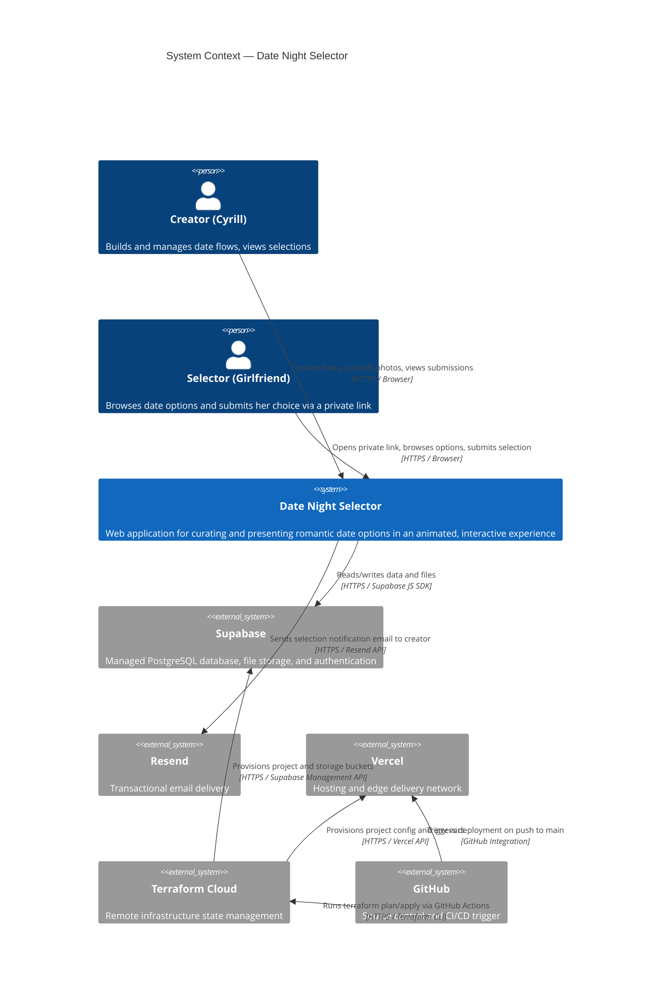

# C4 Level 1 — System Context

Answers: **What does the system do, and who/what does it interact with?**

---

## Diagram

---

## Notes

- The selector has **no account**. Access is controlled by a secret UUID token embedded in the URL.
- The creator is the **only authenticated user** in the system. There is no multi-tenancy.
- Vercel and Supabase are external managed services — the application does not run its own servers or databases.
- GitHub Actions is the CI/CD engine; it delegates infrastructure state to Terraform Cloud.
