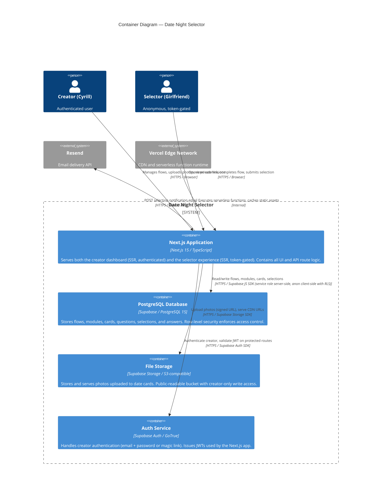

# C4 Level 2 — Container Diagram

Answers: **What are the deployable/runnable units and how do they communicate?**

---

## Diagram

---

## Container Descriptions

### Next.js Application
The single deployable unit. Handles all concerns:
- Server-side rendering of public selector pages for fast mobile load
- Creator dashboard (authenticated, server + client components)
- API routes for mutations, file upload URL generation, and selection submission
- Deployed as serverless functions on Vercel's edge network

### PostgreSQL Database (Supabase)
All application data. Row-level security policies enforce that:
- The creator can read and write everything they own
- Anonymous users can only read published flows (by token) and insert selections

### File Storage (Supabase Storage)
Photos for date cards. The Next.js API generates a short-lived signed upload URL; the browser uploads directly to Supabase Storage (bypassing the Next.js server). The resulting public CDN URL is stored in the database.

### Auth Service (Supabase Auth / GoTrue)
Creator-only. Issues a JWT on login, refreshed automatically. The Next.js middleware validates the JWT on every request to `/(creator)/*` routes. Selector access is not authenticated — it is controlled by token validation in the API route.

---

## Communication Patterns

| From | To | Protocol | Auth |
|---|---|---|---|
| Browser (creator) | Next.js | HTTPS | Supabase JWT (httpOnly cookie) |
| Browser (selector) | Next.js | HTTPS | Token in URL path |
| Next.js (server) | Supabase DB | HTTPS | Service role key (server-side only) |
| Next.js (client components) | Supabase DB | HTTPS | Anon key + RLS |
| Browser | Supabase Storage | HTTPS | Signed upload URL (time-limited) |
| Next.js (server) | Resend | HTTPS | Resend API key |
