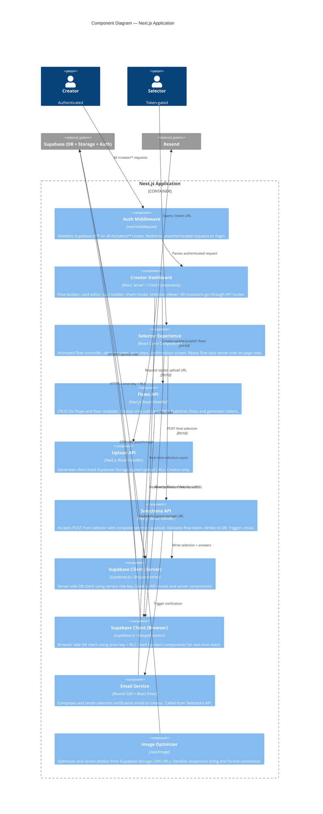

# C4 Level 3 — Components: Next.js Application

Answers: **What are the major internal components of the Next.js application and how do they interact?**

---

## Diagram

---

## Component Responsibilities

### Auth Middleware
- Runs on every request to `/(creator)/*`
- Reads the Supabase session from the httpOnly cookie
- Refreshes expired JWT tokens transparently
- Redirects to `/login` on missing or invalid session

### Creator Dashboard
- Server Components fetch initial data (flow list, card data) server-side for fast render
- Client Components handle interactive state: drag-to-reorder modules, photo preview, live preview of the selector experience
- All writes are `fetch()` calls to the API routes — no direct DB access from the client

### Selector Experience
- Page component is a Server Component that fetches the full published flow by token on load
- Passes data down to `FlowController` (Client Component) which owns the multi-step progression state
- Nothing is written to the DB during flow progression; the full selection is POSTed in one request on final submission

### Flows API
- `GET /api/flows` — list all flows (creator only)
- `POST /api/flows` — create flow
- `PATCH /api/flows/[id]` — update flow metadata or module ordering
- `POST /api/flows/[id]/publish` — set status to published, generate UUID token
- `DELETE /api/flows/[id]` — soft-delete (sets status to archived)

### Upload API
- `POST /api/upload` — validates creator session, returns `{ signedUrl, publicUrl }` from Supabase Storage
- Browser uploads directly to Supabase using the signed URL (no file data passes through Next.js)

### Selections API
- `POST /api/selections` — validates flow token, validates payload structure, writes `selection` + `selection_answers` rows, calls email service
- Idempotency: checks for duplicate submission from same session to prevent double-send

### Email Service
- Composes a React Email template with full selection summary
- Called synchronously from the Selections API (acceptable — Resend API is fast and failure is non-critical)
- On Resend failure: logs error, does not block the selection from being saved
