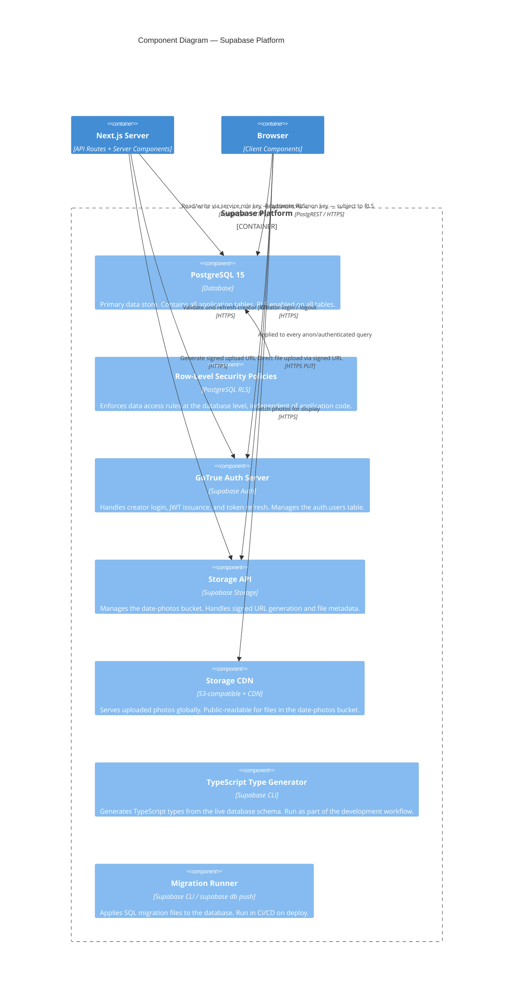

# C4 Level 3 — Components: Supabase

Answers: **What are the internal components of the Supabase platform as used by this system?**

---

## Diagram

---

## RLS Policy Summary

| Table | Anon (selector) | Authenticated (creator) |
|---|---|---|
| `flows` | SELECT where `status = 'published'` and token matches URL param | Full CRUD on own rows |
| `decision_modules` | SELECT via published flow join | Full CRUD |
| `cards` | SELECT via published flow join | Full CRUD |
| `quiz_modules` | SELECT via published flow join | Full CRUD |
| `quiz_questions` | SELECT via published flow join | Full CRUD |
| `selections` | INSERT only (no read-back) | SELECT all |
| `selection_answers` | INSERT only (no read-back) | SELECT all |

---

## Storage Bucket Policy

| Bucket | Read | Write |
|---|---|---|
| `date-photos` | Public (no auth required) | Creator only (validated via signed URL — URL expires in 60 seconds) |

---

## Notes

- The application **never** exposes the service role key to the browser. It is used exclusively in Next.js server-side code (API routes, Server Components).
- The anon key is safe to expose in the browser because RLS policies restrict all access. Without a valid session or flow token, no data is readable.
- TypeScript types are regenerated locally when the schema changes: `supabase gen types typescript --local > types/database.ts`
