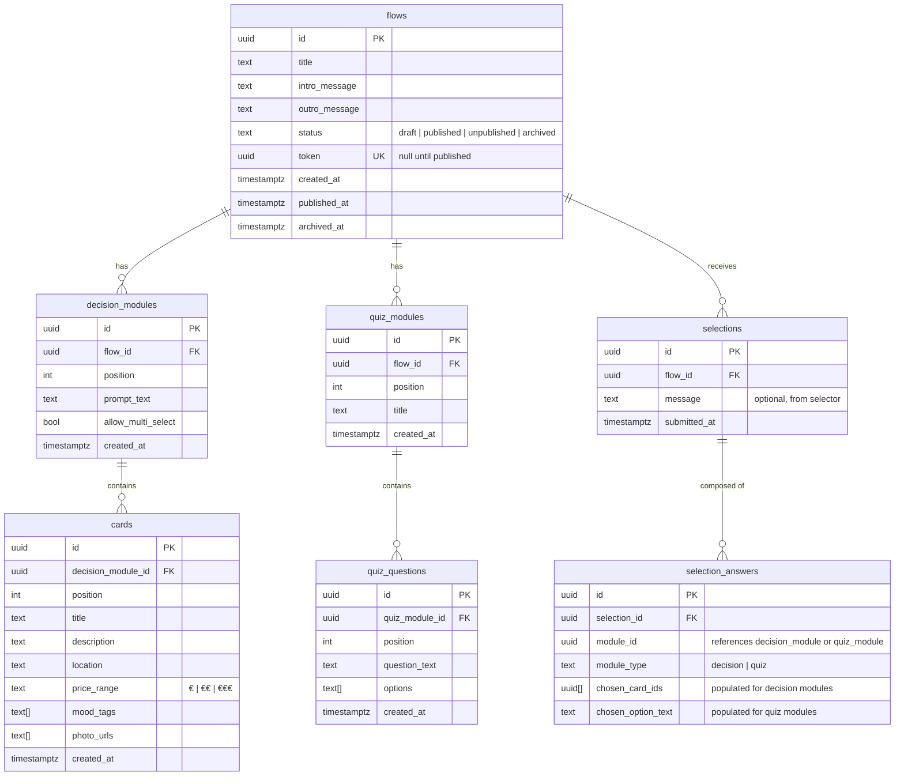

# Entity Relationship Diagram

---

## Diagram

---

## Key Relationships

| Relationship | Cardinality | Notes |
|---|---|---|
| Flow → Decision Modules | 1 to many | A flow can have 0 or more decision modules |
| Flow → Quiz Modules | 1 to many | A flow can have 0 or more quiz modules |
| Decision Module → Cards | 1 to many | Minimum 2 cards required to be meaningful |
| Quiz Module → Quiz Questions | 1 to many | Minimum 1 question required |
| Flow → Selections | 1 to many | A published flow accumulates selections over time |
| Selection → Selection Answers | 1 to many | One answer row per module in the flow |

---

## Design Decisions

**Modules share a `position` space per flow** — decision modules and quiz modules both have a `position` field relative to their parent flow. The `FlowController` on the client merges both sets, sorted by position, to render the correct step order.

**`selection_answers.module_id` is untyped** — it references either `decision_modules.id` or `quiz_modules.id` depending on `module_type`. A true polymorphic FK is not supported in PostgreSQL; a check constraint ensures `module_type` is always set. This avoids the complexity of a union table.

**`photo_urls` is an array column** — each card stores an ordered array of Supabase Storage CDN URLs. This avoids a separate `card_photos` junction table for what is a simple ordered list.

**No soft-delete on modules/cards** — deleting a module or card is permanent. The flow must be in `draft` or `unpublished` status to edit, so there is no risk of deleting data that a selector is currently viewing.
