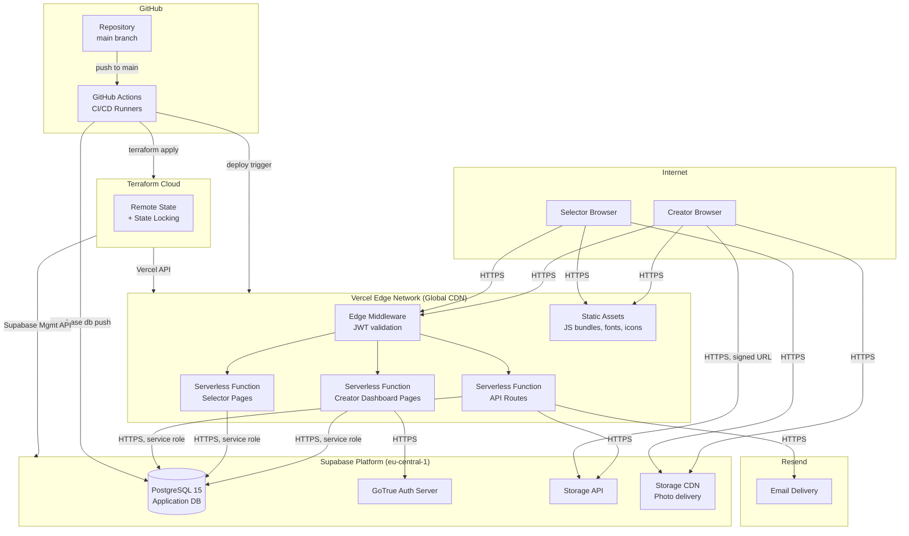

# Deployment Diagram

Shows where each component runs, network boundaries, and how traffic flows in production.

---

## Diagram

---

## Environments

| Environment | Vercel Project | Supabase Project | Branch |
|---|---|---|---|
| Production | `date-selector` (prod) | `date-selector-prod` | `main` |
| Preview | Auto per PR | `date-selector-prod` (read-heavy; no destructive ops) | any PR branch |
| Local dev | `localhost:3000` | Supabase local (Docker) | any feature branch |

---

## Network Trust Boundaries

| Boundary | Description |
|---|---|
| Internet → Vercel Edge | All public traffic. TLS enforced. Rate limiting via Vercel |
| Vercel → Supabase | Internal HTTPS. Service role key never leaves the Vercel serverless environment |
| Browser → Supabase Storage CDN | Direct photo fetch. Public read, no auth required |
| Browser → Supabase Storage API | Direct upload via short-lived signed URL only. No raw credentials in browser |
| GitHub Actions → External APIs | Secrets injected as env vars at runtime; never logged |

---

## Region Strategy

| Service | Region | Rationale |
|---|---|---|
| Vercel | Global edge | Static assets and middleware served from nearest PoP |
| Supabase | eu-central-1 (Frankfurt) | Closest to primary users (Switzerland) |
| Resend | Managed | No region choice; SLA is sufficient for non-critical email |

---

## Key Constraints

- Vercel free tier: serverless functions time out at **10 seconds**. All API routes complete well within this (DB queries < 100ms, Resend API < 500ms).
- Supabase free tier: projects **pause after 7 days of inactivity**. Acceptable for a personal project; can be upgraded to Pro ($25/mo) if uptime guarantee is needed.
- No persistent server processes — the entire application is serverless. Cold starts are mitigated by Vercel's keep-warm behavior on frequently accessed routes.
