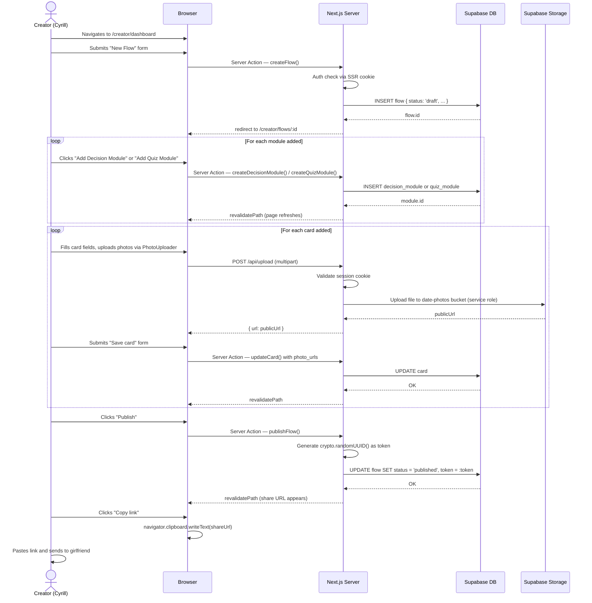

# Sequence Diagram — Creator Building and Publishing a Flow

---

## Happy Path

---

## Error Cases

| Scenario | Behaviour |
|---|---|
| JWT expired during editing | Middleware refreshes automatically; if refresh fails, redirect to login with a "session expired" message |
| Photo upload fails (storage error) | Signed URL step returns error; browser shows inline "Upload failed, try again" under the photo field |
| Publish with no modules | Server returns 422 with `{ error: "A flow must have at least one module before publishing" }` |
| Publish with a card that has no photo | Warning shown in preview; creator can still publish (photo is optional per card) |
| Network drop during card save | Optimistic UI reverts; unsaved changes indicator shown; user retries manually |
