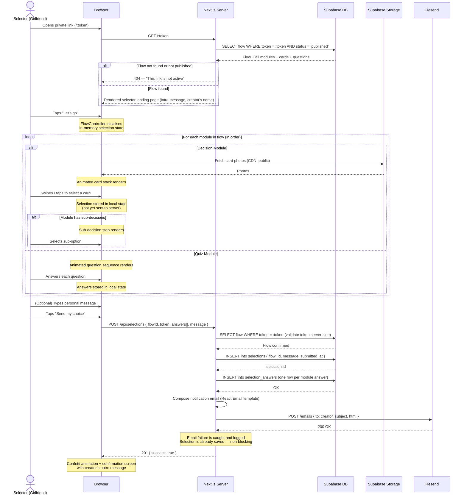

# Sequence Diagram — Selector Completing a Flow

This is the primary user journey: the girlfriend opens the private link and completes her selection.

---

## Happy Path

---

## Error Cases

| Scenario | Behaviour |
|---|---|
| Token invalid or flow unpublished | Server returns 404; browser shows "This link is not active" page |
| Network drops mid-flow | Selection state is in memory; user can retry submission without re-doing the flow (state is preserved in React) |
| Submission POST fails (5xx) | Error UI shown; retry button; selection state preserved |
| Resend API fails | Email silently fails; selection is saved; creator can view in dashboard |
| Duplicate submission (same token, same session) | Server returns 409; browser shows "You've already submitted your choice" screen |
