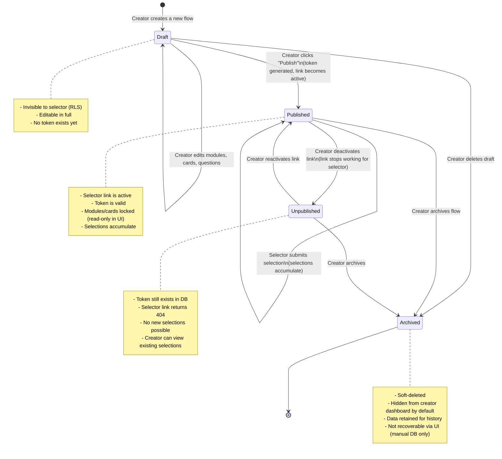

# State Diagram — Flow Lifecycle

The `flows` table has a `status` column that drives access control, UI presentation, and allowed operations.

---

## Diagram

---

## Transition Rules

| Transition | Trigger | Side Effects |
|---|---|---|
| Draft → Published | `POST /api/flows/:id/publish` | Generates UUID token, sets `published_at` timestamp |
| Published → Unpublished | `PATCH /api/flows/:id { status: 'unpublished' }` | Token preserved; selector link returns 404 |
| Unpublished → Published | `PATCH /api/flows/:id { status: 'published' }` | Same token reused; link becomes active again |
| Any → Archived | `DELETE /api/flows/:id` | Sets `status = 'archived'`, sets `archived_at`; data not deleted |

---

## Why Editing is Locked on Published Flows

Once a flow is published, the selector may open the link at any time. Editing modules or cards mid-session would cause the selector to see an inconsistent state (e.g., a card they already selected disappears). If the creator needs changes, they should unpublish, edit, and republish — which generates a new share URL.

This is enforced in the API: `PATCH /api/flows/:id/modules/*` returns `423 Locked` if `flow.status = 'published'`.
